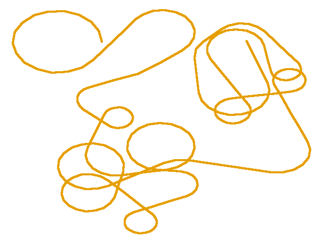
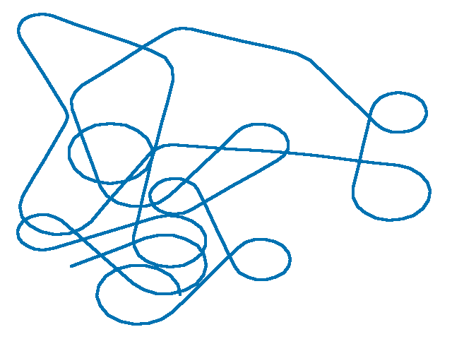
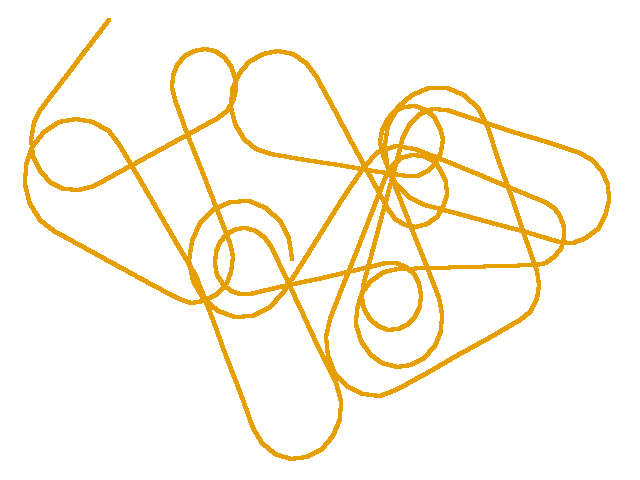
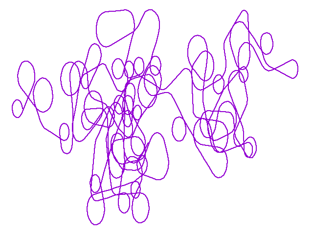

-----------------------
Arc Attack
-----------------------
A pseudorandom, procedural art generator. Arcs and line segments team up to generate a continuous curve.

-----------------------
Motivation for doing this
-----------------------
I like procedural art. Someone once told me that every curve could be expressed as a collection of circles and line segments. I created this program to explore the universe of circles and line segments.

-----------------------
Prerequistes
-----------------------
   python 3.3+ (run script requires python3's `venv` module)
   
   gnuplot (to visualize the output)

-----------------------
How to run
-----------------------
    git clone https://github.org/difley/arc-attack.git
    cd arc-attack.git
    bash run.sh

run.sh can be given an optional random seed for use by the pseudorandom number generator. Try different seeds. Find a resulting curve that you like. For example,

    bash run.sh 656354

-----------------------
Viewing the resulting plot
-----------------------
A file called output.png will be in the folder where the Arc Attack
was cloned if the prerequisites were installed and no errors were
encountered.

If gnuplot was not installed but no other errors were encountered,
a file called output.out will be in the cloned folder. This file
the coordinate points generated by the program.

