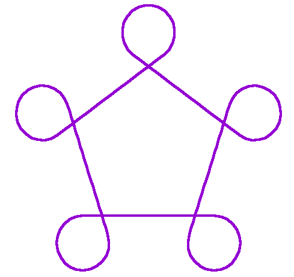
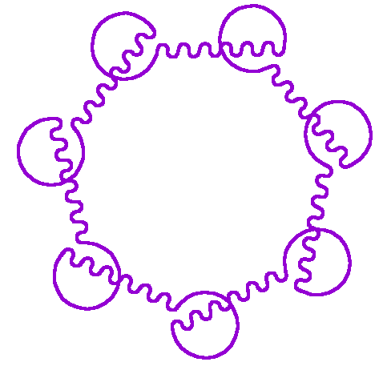
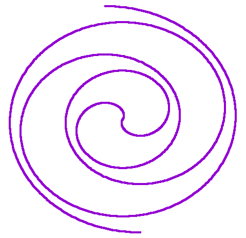
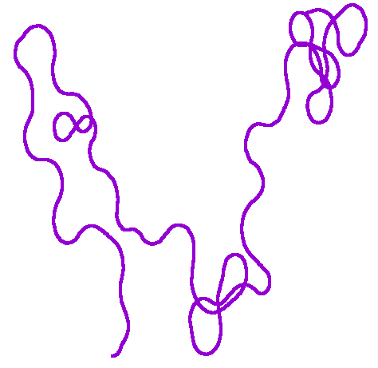
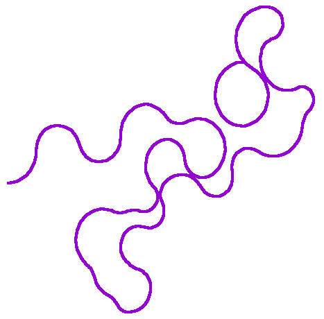

-----------------------
Arc Attack
-----------------------
A pseudorandom, procedural art generator. Arcs and line segments team up to generate a continuous curve.

-----------------------
Motivation for doing this
-----------------------
I'm fascinated by procedural art and computational geometry. I wrote this program to explore how circular arcs and line segments can be joined together to generate visually pleasing curves.

Polygon

Wavy polygon

Spiral

Random curve (overlapping)

Random curve (non-overlapping)

-----------------------
Prerequistes
-----------------------
   python 3.3+ (run script requires python3's `venv` module)
   
   gnuplot (to visualize the output)

   MacOS Preview (to visualize the output)

-----------------------
How to run the examples
-----------------------
Five examples are provided in the examples/ folder. To run the wavy polygon example, use these commands in the shell:
        
    git clone git@github.com:difley/arc-attack.git
    cd arc-attack
    bash examples/wavy_polygon/run.sh

The other four examples can be run analogously. For example, the spiral example can be run from the clone root folder with:

    bash examples/spiral/run.sh
